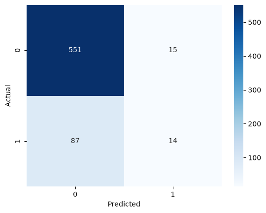
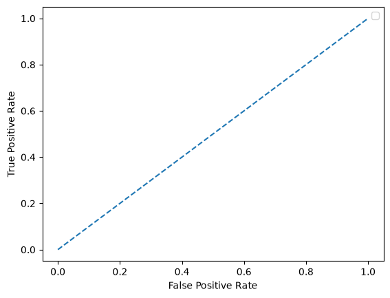
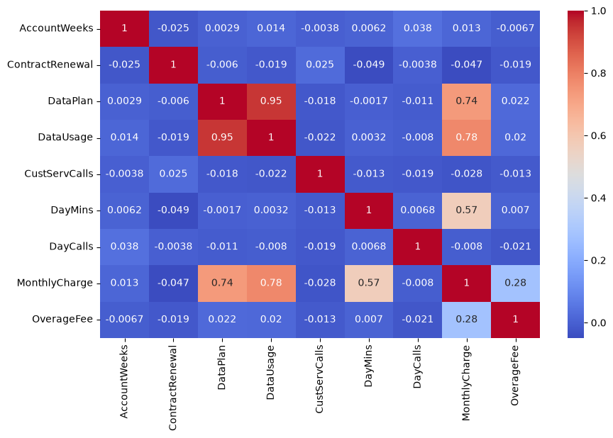

# 📊 Churn Prediction Project

## 🔎 Overview
Telecom Churn Prediction using Python and ML models.  
Goal: Identify at-risk customers and reduce churn.

## ⚙️ Features
- Data cleaning & preprocessing  
- Feature engineering (customer demographics, usage patterns)  
- Models: Logistic Regression, Random Forest, XGBoost  
- Evaluation: Accuracy, Confusion Matrix, ROC AUC  

## 🚀 How to Run
1. Clone repo:
   ```bash
   git clone https://github.com/username/Churn-Prediction-Project.git
## 📂 Project Structure
Churn-Prediction-Project/
├── data/                # datasets
├── notebooks/           # Jupyter notebooks
├── src/                 # Python scripts
│   ├── data_cleaning.py
│   ├── feature_engineering.py
│   ├── model_training.py
│   └── evaluation.py
├── plots/               # graphs & visualizations
├── requirements.txt
├── Pipeline.py          # main pipeline runner
└── README.md
## ▶️ Usage
- Train model:
  ```bash
  python Pipeline.py --train
## 📊 Results
- Best Model: Random Forest (ROC AUC ~0.85)
- Key churn factors: Contract type, Monthly Charges, Tenure
- Visualizations: Confusion Matrix, ROC Curve, Feature Importance
## 📦 Dependencies
- Python 3.10+
- pandas, numpy, scikit-learn, seaborn, matplotlib
## 🤝 Contribution
Pull requests are welcome. For major changes, please open an issue first to discuss.
## 👩‍💻 About Me
I am Muskan Shaikh, Data Analyst skilled in Python, SQL, Power BI, and excel.  
📌 [LinkedIn](https://www.linkedin.com/in/yourprofile) | [GitHub](https://github.com/yourusername)
## 📊 Results
- Best Model: Random Forest (ROC AUC ~0.85)
- Key churn factors: Contract type, Monthly Charges, Tenure

### Confusion Matrix


### ROC Curve


### Correlation Heatmap

